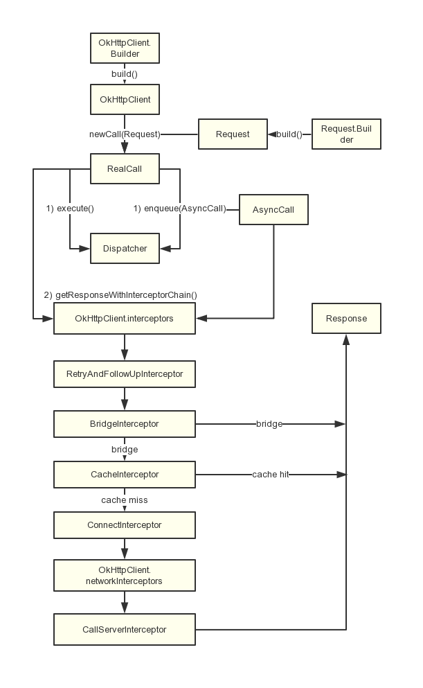
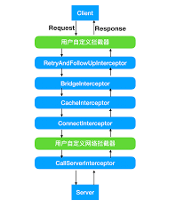
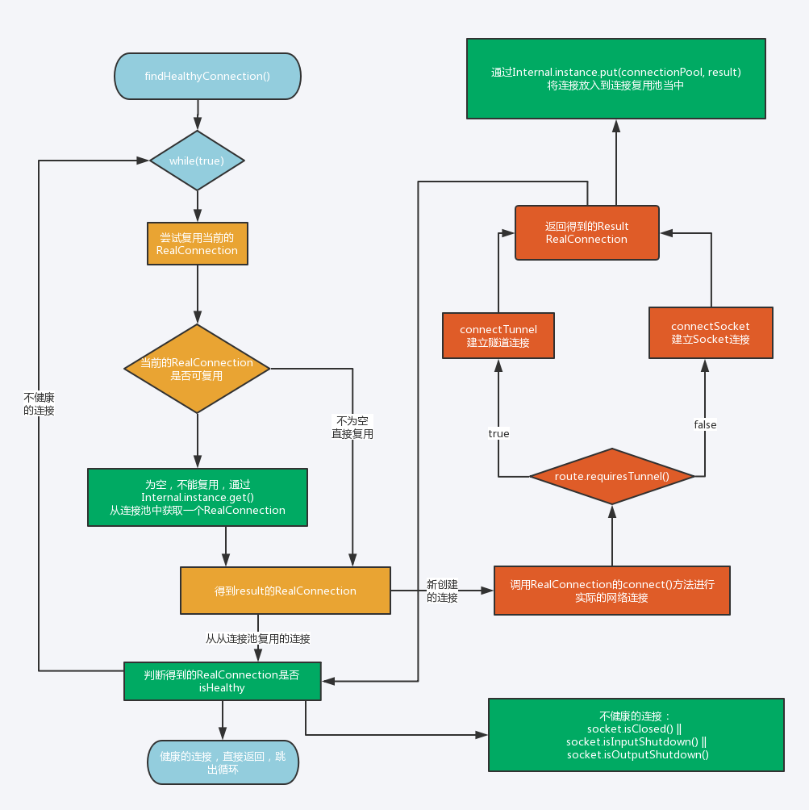

### okhttp 技术分享资料的

##### 1、基础概念理解
  [HTTP2和HTTP1的区别](https://juejin.im/entry/5981c5df518825359a2b9476)
  
  http1.1 相比 http1.0 改进
  
      1、缓存处理  2、带宽优化及网络连接的使用 3、错误通知的管理 
      4、Host头处理 5、长连接复用
      
  http2 相比 http1.1 改进
   
     1、新的二进制格式 2、多路复用 3、header压缩 4、服务端推送

  [缓存讲解](https://www.jianshu.com/p/e0dd6791653d)  etag

#####2、okhttp [简介](https://square.github.io/okhttp/)
 
   物理质量：
   
       使用OKHttp需要okio.jar(大概80k)和okhttp.jar(大概330k)这两个jar包，总大小差不多400k，再加上自己的封装差不多410k。
   
   功能介绍：
   
       Square公司开源的OKHttp是专注于连接效率的Http客户端，OKHttp提供了HTTP2和SPDY的支持并提供了链接池，GZIP压缩和HTTP响应缓存功能
       支持HTTP/2 协议，允许连接到同一个主机地址的所有请求共享Socket。这必然会提高请求效率。
       在HTTP/2协议不可用的情况下，通过连接池减少请求的延迟。
       GZip透明压缩减少传输的数据包大小。
       响应缓存，避免同一个重复的网络请求。
       
   优点：
   
       1、支持Http和Https请求  2、支持文件下载 4、支持GET、POST请求  5、基于HTTP的文件上传 6、加载图片
   
   缺点：
   
       1、CallBack回调在线程里，不能更新UI，需要手动操作  2、封装较麻烦

##### 3、同其他网络实现比较
       
   HttpClient
   
     是Apache的一个三方网络框架，网络请求做了完善的封装，api众多，用起来比较方便，开发快。实现比较稳定，bug比较少，但是正式由于其api众多，是我们很难再不破坏兼容性的情况下对其进行扩展。
     所以，Android团队对提升和优化httpclient积极性并不高。android5.0被废弃，6.0逐渐删除。
     
   HttpURLConnection
   
    是一个多用途、轻量级的http客户端。它对网络请求的封装没有HttpClient彻底，api比较简单，用起来没有那么方便。但是正是由于此，使得我们能更容易的扩展和优化的HttpURLConnection。
    不过，再android2.2之前一直存在着一些令人烦的bug，比如一个人可读的inputstream调用它的close方法的时候，会使得连接池实效，通常的做法就是禁用连接池。
    因此，在android2.2之前建议使用稳定的HttpClient，android2.2之后使用更容易扩展和优化的
    
   [Volley](https://github.com/google/volley)
   
   物理质量：
   
       使用Volley需要Volley.jar(大概120k)加上自己的封装大概140k
   功能介绍：
   
       Volley是Goole在2013年I/O大会上提出的新的网络通信框架，它是开源的。Volley的特点：特别适合数据量小，通信频繁的操作
   优点：
   
       1、非常适合数据量不大，通信频繁的网络操作
       2、内部封装了异步线程
       3、支持GET、POST请求
       4、图片下载
       5、可直接在主线程当中调用返回结果更新UI
       6、可以取消请求、容易扩展面向接口编程
   缺点：
   
       1、对于大文件下载Volley表现的非常糟糕（默认只有4K响应缓存区 不够会扩充的）
       2、只支持Http请求
       3、图片加载性能一般
       4、采用了HttpClient、HttpURLConnection，在android6.0后不支持HttpClient，如果想支持需添加org.apache.http.legacy.jar

#####4、基础概念的

   
    
    OkHttpClient：通信的客户端，用来统一管理发起请求与解析响应。
    Call：Call是一个接口，它是HTTP请求的抽象描述，具体实现类是RealCall，它由CallFactory创建。
    Request：请求，封装请求的具体信息，例如：url、header等。
    RequestBody：请求体，用来提交流、表单等请求信息。
    Response：HTTP请求的响应，获取响应信息，例如：响应header等。
    ResponseBody：HTTP请求的响应体，被读取一次以后就会关闭，所以我们重复调用responseBody.string()获取请求结果是会报错的。
    Interceptor：Interceptor是请求拦截器，负责拦截并处理请求，它将网络请求、缓存、透明压缩等功能都统一起来，每个功能都是一个Interceptor，所有的Interceptor最 终连接成一个Interceptor.Chain。典型的责任链模式实现。
    StreamAllocation：用来控制Connections与Streas的资源分配与释放。
    RouteSelector：选择路线与自动重连。
    RouteDatabase：记录连接失败的Route黑名单。

   1、OkHttpClient以及Request的构造器

     public Builder() {
       dispatcher = new Dispatcher();    // 分发器，另有一个带线程池参数的构造器
       protocols = DEFAULT_PROTOCOLS;    // 支持的协议，默认为HTTP_2、HTTP_1_1
       connectionSpecs = DEFAULT_CONNECTION_SPECS;  // 传输层版本、连接协议
       eventListenerFactory = EventListener.factory(EventListener.NONE);  // 事件监听器，3.8版本set方法还是package级别的，暂时不能设置
       proxySelector = ProxySelector.getDefault();   // 代理选择器
       cookieJar = CookieJar.NO_COOKIES;             // 读写Cookie的容器
       socketFactory = SocketFactory.getDefault();   // Socket工厂
       hostnameVerifier = OkHostnameVerifier.INSTANCE;// 主机名验证器
       certificatePinner = CertificatePinner.DEFAULT;
       proxyAuthenticator = Authenticator.NONE;      // 代理认证器
       authenticator = Authenticator.NONE;           // 本地认证器
       connectionPool = new ConnectionPool();        // 连接池
       dns = Dns.SYSTEM;                             // 域名
       followSslRedirects = true;                    // SSL重定向
       followRedirects = true;                       // 普通重定向
       retryOnConnectionFailure = true;              // 连接失败重试
       connectTimeout = 10_000;                      // 连接超时时间
       readTimeout = 10_000;                         // 读超时时间
       writeTimeout = 10_000;                        // 写超时时间
       pingInterval = 0;
     }
  2 、Call & RealCall
  
      在这一步生成call对象 并且在这一步生成 Transmitter(应用程序和网络层的桥接器) 并set到call对象中
      execute() 同步请求   enqueue(Callback responseCallback)  异步请求
      最主要的是要调用这个方法
      getResponseWithInterceptorChain();
      
  3、Dispatcher 分发器
  
     promoteAndExecute() 判断是否有要运行的call(在一个call执行完了之后调用 或 加入一个异步call之后使用的 )

     不管同步还是异步 最终都会调用 RealCall 中这个 promoteAndExecute() 方法

  4、[拦截器](https://juejin.im/post/5aa23fa46fb9a028cb2d3a96) 
     
     
      首先将以下拦截器依次加入到List中：
          OkHttpClient设置的拦截器interceptors()
          重试、重定向拦截器RetryAndFollowUpInterceptor   如果出现异常可以重试  while循环地下是重定向的请求 重定向最多20次
          把用户请求转换为服务器请求、把服务器返响应转换为用户响应的BridgeInterceptor   主要做了添加请求首部字段的操作包括cookie  response GZIP 解压
          读取缓存直接返回、将响应写入到缓存中的CacheInterceptor
          与服务器建立连接的[ConnectInterceptor](https://blog.n0texpecterr0r.cn/2019/08/01/%E3%80%90android%E3%80%91okhttp-%E6%BA%90%E7%A0%81%E5%89%96%E6%9E%90%E7%B3%BB%E5%88%97%EF%BC%88%E5%9B%9B%EF%BC%89-%E8%BF%9E%E6%8E%A5%E7%9A%84%E5%BB%BA%E7%AB%8B%E6%A6%82%E8%BF%B0/)   
          OkHttpClient设置的网络拦截器networkInterceptors()
          真正执行网络请求的CallServerInterceptor

      将所有的拦截器保存在interceptors后，创建一个拦截器责任链RealInterceptorChain，并调用其proceed开始处理网络请求。
      
   链接拦截器的流程
   
   
   
  5、额外的
  
    1、请求列表用的   数据结构 可以快速随机访问数组实现
    2、Route 这里的路由选择并不是指网络层的路由选择，而是指经过代理发送数据路径的选择
  6、okio 的一些概念的
  
    Okio 有自己的流类型，那就是 Source 和 Sink，它们和 InputStream 与 OutputStream 类似，前者为输入流，后者为输出流。
    注意：因为get请求没有body 所以不需要检查 source 输入流的检查 也就是 doExtensiveHealthChecks 为false

  但它们还有一些新特性：
  
    超时机制，所有的流都有超时机制；
    API 非常简洁，易于实现；
    Source 和 Sink 的 API 非常简洁，为了应对更复杂的需求，Okio 还提供了 BufferedSource 和 BufferedSink 接口，便于使用（按照任意类型进行读写，BufferedSource 还能进行查找和判等）；
    不再区分字节流和字符流，它们都是数据，可以按照任意类型去读写；
    便于测试，Buffer 同时实现了 BufferedSource 和 BufferedSink 接口，便于测试；
    Source 和 InputStream 互相操作，我们可以把它们等同对待，同理 Sink 和 OutputStream 也可以等同对待。
